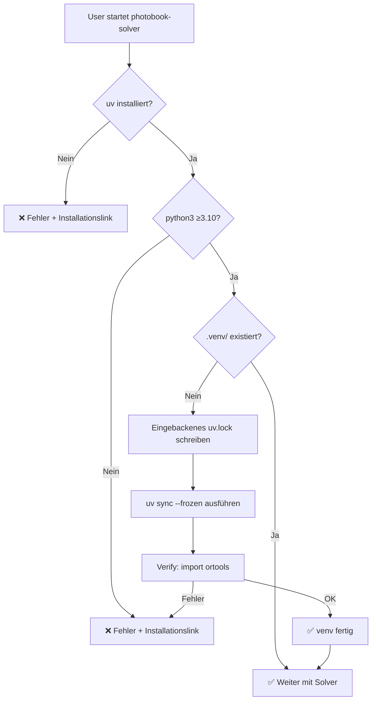

# 5. Environment-Setup & Dependencies

## Voraussetzungen

**User muss installiert haben:**

1. **Python 3.10+**
   ```bash
   python3 --version  # ≥3.10
   ```

2. **uv** (Python Package Manager)
   ```bash
   curl -LsSf https://astral.sh/uv/install.sh | sh
   ```

---

## Setup-Flow (Rust automatisiert)



---

## uv.lock einbacken (Build-Zeit)

```rust
// build.rs
use std::fs;

fn main() {
    // uv.lock aus python/ einlesen
    let lock_content = fs::read_to_string(\"python/uv.lock\")
        .expect(\"Run 'cd python && uv lock' first\");
    
    // Als Environment-Variable für Rust-Code verfügbar machen
    println!(\"cargo:rustc-env=UV_LOCK_CONTENT={}\", lock_content);
    println!(\"cargo:rerun-if-changed=python/uv.lock\");
}
```

```rust
// src/python_env.rs
const UV_LOCK: &str = env!(\"UV_LOCK_CONTENT\");

impl PythonEnv {
    fn create_venv_from_lock() -> Result<()> {
        // Lock schreiben
        fs::write(\"uv.lock\", UV_LOCK)?;
        
        // uv sync --frozen (installiert exakte Versionen)
        Command::new(\"uv\")
            .args([\"sync\", \"--frozen\"])
            .status()?;
        
        Ok(())
    }
}
```

---

## Fehlermeldungen

### uv nicht gefunden

```
❌ Error: 'uv' not found

Please install uv:
  • Linux/Mac:   curl -LsSf https://astral.sh/uv/install.sh | sh
  • Windows:     powershell -c \"irm https://astral.sh/uv/install.ps1 | iex\"
  • Homebrew:    brew install uv

See: https://docs.astral.sh/uv/getting-started/installation/
```

### Python nicht gefunden oder zu alt

```
❌ Error: Python 3.10+ not found

Please install Python 3.10 or newer:
  • Ubuntu/Debian:  sudo apt install python3
  • macOS:          brew install python3
  • Windows:        Download from python.org

Current: not found
Required: ≥3.10
```

---

## Dependencies

### Rust

```toml
[dependencies]
anyhow = "1"
clap = { version = "4", features = ["derive"] }
chrono = "0.4"
kamadak-exif = "0.6"
serde = { version = "1", features = ["derive"] }
serde_json = "1"
dirs = "5"
reqwest = { version = "0.11", features = ["blocking", "json"] }
typst = "0.14"
typst-pdf = "0.14"
log = "0.4"
env_logger = "0.11"
rand = "0.8"

[dev-dependencies]
cargo-tarpaulin = "0.27"  # Coverage
```

### Python 

```toml
[project]
dependencies = [
    \"fastapi>=0.109\",
    \"pydantic>=2.0\",
    \"uvicorn>=0.27\",
    \"typer>=0.9\",
    \"ortools>=9.10\",
]

[tool.uv]
dev-dependencies = [
    "pytest>=7.0",
    "pytest-cov>=4.0",  # Coverage
    "httpx>=0.26",      # For testing FastAPI
    "ruff>=0.3",        # Linter & Formatter
    "mypy>=1.8",        # Type checker
    "pillow>=10.0",     # For test data generation
    "typer>=0.9",       # CLI for test scripts (also prod dep)
]

[tool.ruff]
line-length = 100
target-version = "py310"

[tool.ruff.lint]
select = ["E", "F", "I", "N", "W", "UP", "ANN"]  # + Type annotations
ignore = ["ANN101", "ANN102"]  # self, cls annotations optional

[tool.mypy]
python_version = "3.10"
strict = true
warn_return_any = true
warn_unused_configs = true
```

---

➡️ [6. JSON-Schnittstelle](6_json-schnittstelle.md)
