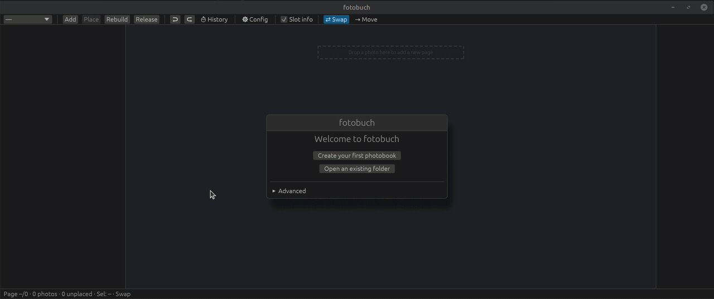
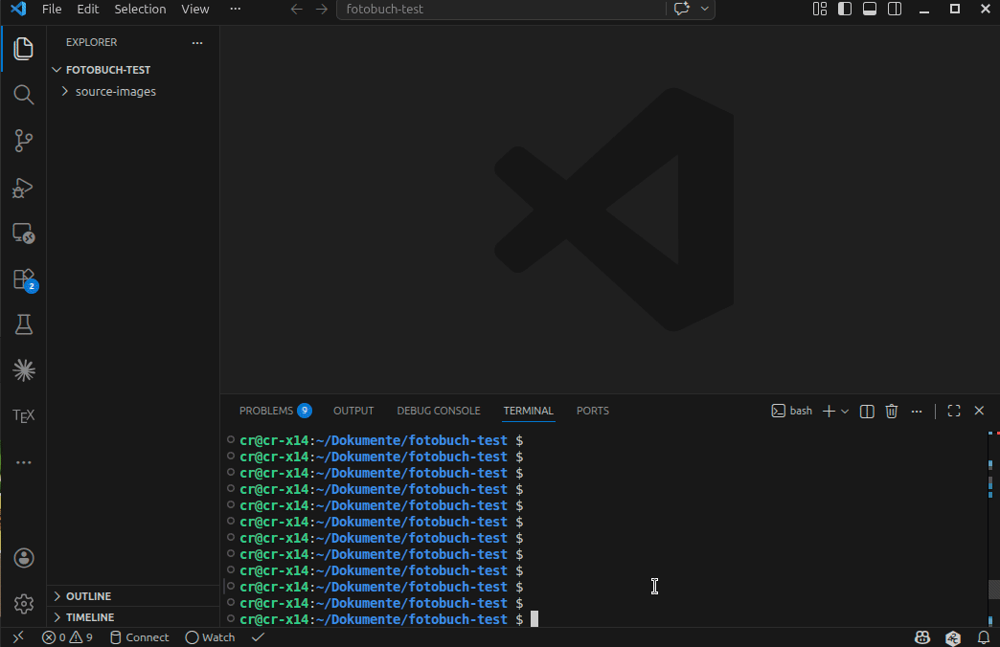

# fotobuch

### Drop in your photos. Get a print-ready photobook.

No cropping. No distortion. No fiddly drag-and-drop for hours — just your
pictures, beautifully arranged by a science-backed layout engine. Open the app,
drop in a folder, done. Or script the whole thing from the terminal. Your call.

<!-- Badges -->
[](https://github.com/EddyXorb/fotobuch/actions/workflows/ci.yml)
[](https://codecov.io/gh/EddyXorb/fotobuch)
[](https://github.com/EddyXorb/fotobuch/releases/latest)
[](https://www.gnu.org/licenses/agpl-3.0)

<div align="center">



*Drag a folder in, watch the solver build your pages live.*

</div>


## What is fotobuch?

`fotobuch` (= *photobook* in German) automatically turns a pile of images into a
print-ready layout you can send straight to a professional printing service.

It is built for books with **many images per page** — exactly the kind that is
tedious to lay out by hand. Many-image photobooks deserve to be made a certain
way, and `fotobuch` is an opinionated tool that supports exactly one philosophy of
what such a book should look like.

**Why does it exist?** `fotobuch` started as my personal solution to the
yearly pain of turning thousands of photos into a printed book the commercial
tools couldn't make the way I wanted. Have a look at:
[Why I built fotobuch](docs/why-i-built-this.md).

## Two ways to use it

**The app — recommended for everyone.**
Launch `fotobuch-gui`, drag a folder of photos onto the window, and watch the
solver lay out your pages live. Rearrange anything by dragging, right-click for
options, hit **Release** to export a print-ready PDF. No command line required.

**The command line — for power users.**
Every action is also a scriptable, git-tracked CLI command. Automate an entire
book, diff your changes, roll back any step.

Both share the exact same engine and project files, so you can switch between the
app and the terminal at any time.

## Why opinionated?

Every design decision in the layout algorithm reflects a deliberate aesthetic
stance: photos are not cropped, not distorted, not squeezed to fill a gap. A
photographer chooses a frame intentionally — `fotobuch` respects that choice.
There are no splashy frames, overlays, smileys, or other distractions; only the
photos you chose, presented with care.

Further key principles:

- **Full automation, full control.** Let the solver do all the work, or step in and
  adjust any page manually.
- **Aspect ratios are sacred.** Every photo is shown exactly as it was shot — no
  cropping, no distortion. The solver finds a layout that fits, not one that forces.
- **Reading flow matters.** Photos are arranged so the eye moves naturally from top-left
  to bottom-right, mirroring how we read. The sequence of your story is preserved.
- **Weight your images.** Tell `fotobuch` which photos deserve more space. Important
  moments appear larger; supporting shots stay smaller. The balance is yours to set.
- **Groups stay together.** Photos from the same event or folder are treated as a unit.
  The book flows from one group to the next without mixing, unless you want it to.
- **Tiny footprint.** A project is fully described by a single YAML file and a Typst
  source file. As long as your source photos stay where they are, the entire book takes
  almost no additional disk space.
- **Science-backed algorithms.** The layout engine is built on published research and
  novel unpublished extensions — the result is a solver that produces genuinely better
  layouts than off-the-shelf approaches. See [Technical Background](#technical-background).


## A look at the results

<div align="center">


</div>


## Installation

Pre-built binaries for Linux and Windows are available on the
[Releases page](https://github.com/EddyXorb/fotobuch/releases/latest).

### Build from source

**Requirements:** Rust (stable) — install via [rustup.rs](https://rustup.rs)

```bash
git clone https://github.com/EddyXorb/fotobuch.git
cd fotobuch
cargo build --release --features gui
# GUI:  ./target/release/fotobuch-gui
# CLI:  ./target/release/fotobuch
```
## Documentation

The full documentation can be found [here](https://eddyxorb.github.io/fotobuch).


## Quick Start

1. **Launch** `fotobuch-gui`.
2. **Drag a folder of photos** onto the window. Each folder becomes a group;
   timestamps in folder names set the order.
3. **Hit Rebuild** and watch the solver lay out your pages — then every later
   change rebuilds the affected pages automatically.
4. **Refine by dragging:** swap slots, move photos between pages, or drop them
   back into the pool to remove them. Right-click a photo for weight, info and more.
5. **Hit Release** to export a print-ready 300-DPI PDF.

Every change is saved and version-controlled automatically — undo any step with
`Ctrl+Z`.

<details>
<summary><b>Prefer the command line? Here is the same workflow, scripted.</b></summary>

<br>

**Tip:** pair the CLI with [VS Code](https://code.visualstudio.com/) and the
[Typst Preview](https://marketplace.visualstudio.com/items?itemName=mgt19937.typst-preview)
extension so you see the layout update live. Alternatively, just keep a PDF viewer open.

```bash
# 1. Create a new project (page size in mm, e.g. A4 landscape)
fotobuch project new my-book --width 297 --height 210

# 2. Add photos (folders are treated as groups; timestamps in folder names set order)
fotobuch add /path/to/photos/2024-07-Italy
fotobuch add /path/to/photos/2024-08-Hiking

# 3. Build a preview (low DPI, fast)
fotobuch build

# 4. Adjust the layout
fotobuch page swap 3 5            # swap pages 3 and 5
fotobuch page move 3:2 to 4       # move slot 2 from page 3 to page 4
fotobuch build                    # re-run solver to apply changes and get updated preview
fotobuch undo                     # undo last change

# 5. Export final PDF (300 DPI, print-ready)
fotobuch build release
```



</details>

Full workflow and all commands: **[see the documentation](https://eddyxorb.github.io/fotobuch)**


The layout itself is stored as a Typst (`.typ`) file alongside the YAML. Advanced users
can edit it directly and recompile with `typst compile fotobuch.typ fotobuch.pdf`.

Full configuration reference: **[see the documentation](https://eddyxorb.github.io/fotobuch)**

## Technical Background

### YAML Configuration

Every project is described by a `fotobuch.yaml` in the project directory.
Running `fotobuch config` prints the resolved configuration with all defaults applied.

```yaml
config:
  book:
    title: my-book
    page_width_mm: 297.0
    page_height_mm: 210.0
    bleed_mm: 3.0
    margin_mm: 10.0
    gap_mm: 3.0
    dpi: 300.0
  book_layout_solver:
    photos_per_page_min: 1
    photos_per_page_max: 6
    search_timeout:
      secs: 30
      nanos: 0
  preview:
    show_filenames: false
    max_preview_px: 800
```


### Git-based project history

Every change made by `fotobuch` (adding photos, rebuilding a page, moving slots) is
committed to a Git repository inside the project folder. You can inspect the full
history with `fotobuch history` or standard `git log`, and roll back any step with
`fotobuch undo`.

### Caching and DPI-accurate rendering

`fotobuch` maintains two image caches:

- **Preview cache** – downscaled to 150 DPI (configurable). Fast to build, used during
  layout iteration.
- **Release cache** – full resolution at 300 DPI (configurable). Built on demand for the
  final print PDF.

The Typst compiler embeds cached images, so the final PDF is fully self-contained and
ready to upload to print services such as Saal Digital.

### Incremental builds

Only pages that have changed since the last build are recomputed. A change is detected
by comparing image hashes and layout state. This makes iterative refinement fast even
for large books.

### PDF generation — Typst

The final photobook is rendered to PDF by [Typst](https://typst.app/), a modern
typesetting system that replaces LaTeX for programmatic document generation.
`fotobuch` emits a `.typ` source file describing every page, and Typst compiles it
into a print-ready PDF in (milli-)seconds.

Typst deserves a special mention here: what would have been a nightmare of fragile
LaTeX macros, broken package dependencies, and cryptic error messages turned out to be
a breeze. Typst's clean scripting model, fast compile times, and first-class support
for precise absolute positioning made it the ideal backend for a layout-heavy tool like
`fotobuch`. A big thank-you to the Typst team and community for building something
this good.

### Page layout solver — Genetic algorithm with exact gap handling

Single-page layout is solved by a genetic algorithm operating on *slicing trees*, a
data structure from academic layout research. The foundational algorithm is described in:

> O. Fan, *"Genetic Algorithm for Layout Optimization"*,
> [IEEE Xplore, 2012](https://ieeexplore.ieee.org/document/6266273).

Many thanks to the author for this elegant foundation.

A big thank-you also to [@masse](https://github.com/masse) for
[collage-solver](https://github.com/masse/collage-solver), whose work was an inspiring
starting point and proof that slicing-tree approaches produce genuinely beautiful results.

Each individual in the population encodes a complete binary partition of the page area.
The population is evolved with island-model parallelism: independent sub-populations
evolve in parallel on separate threads, with periodic migration between islands.

**Novel contribution — exact gap computation in O(n):**
The original algorithm approximates the inter-photo gap (beta) or recomputes it in
O(n³) per fitness evaluation. `fotobuch` derives an exact closed-form solution: given
a slicing tree, the precise gap that fills the page without any overlap or leftover
space can be computed via an *affine vector-space transformation* of the tree's size
expressions. This reduces complexity from O(n³) to **O(n)** per evaluation — a
significant speedup for pages with many photos — while guaranteeing pixel-accurate
placement. This formulation does not appear in the literature.

**Reading-order preservation via DFS indexing:**
Photos are assigned to tree leaves in depth-first order, ensuring the visual reading
sequence (top-left to bottom-right) matches the chronological order of the input.
This requires a different mutation strategy: instead of swapping arbitrary nodes, the
mutator exchanges only leaves with compatible aspect ratios, preserving the DFS sequence.

### Book layout solver — Dynamic Programming

Assigning photos to pages (how many photos go on which page, and which photos belong
together) is a sequence-partitioning problem solved **exactly** by a dynamic program.
The objective balances page fill, group coherence, and user-defined photo weights. The
DP is optimal, deterministic and runs in milliseconds even for thousand-photo books, so
no problem decomposition is needed. See `docs/design/book_layout_solver_dp/dp.typ` for
the derivation.


## License

`fotobuch` is licensed under the [GNU Affero General Public License v3.0](LICENSE).

For commercial use (e.g. integrating fotobuch into a paid service or product), please
[contact me](mailto:eddyxorb@gmail.com) to discuss a commercial license.
