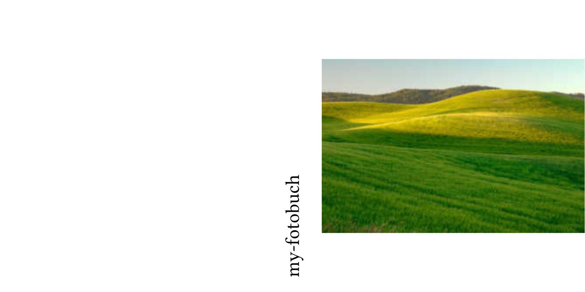
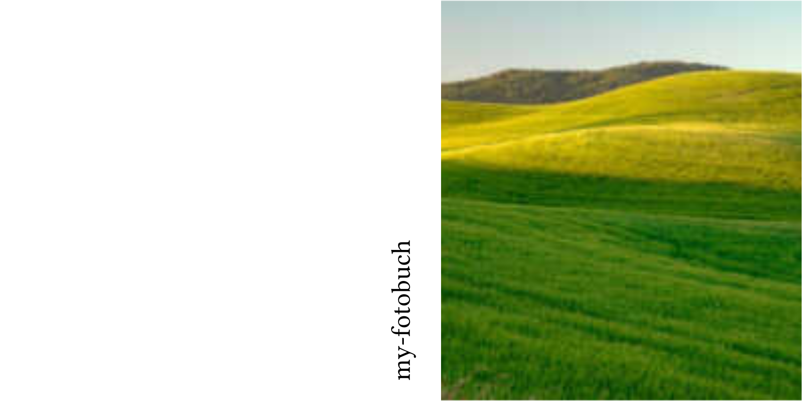
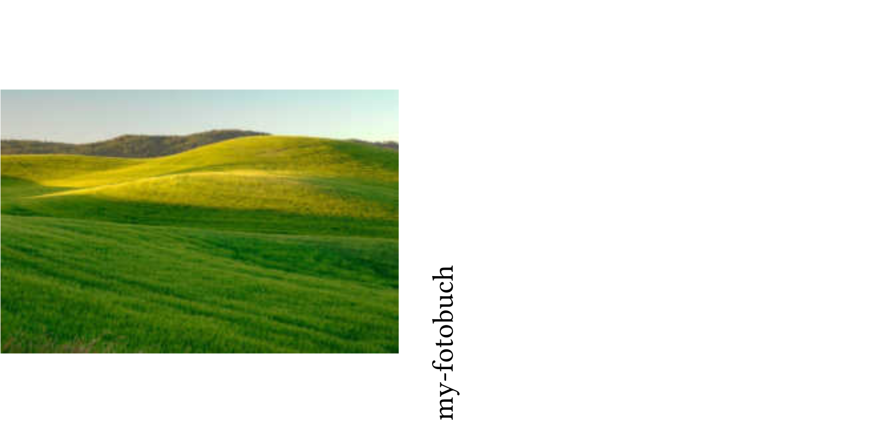
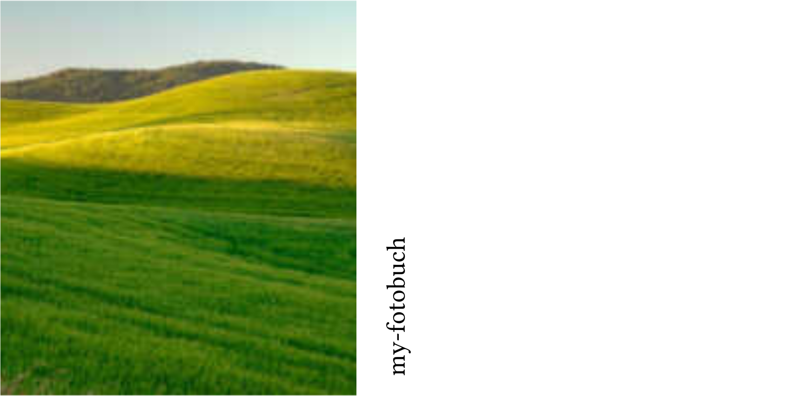
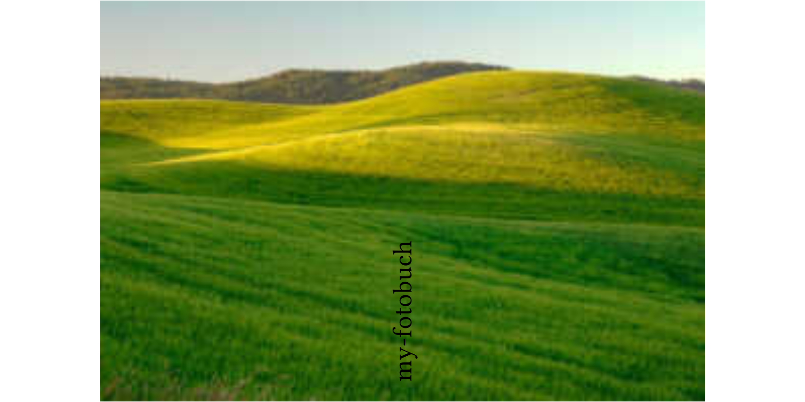
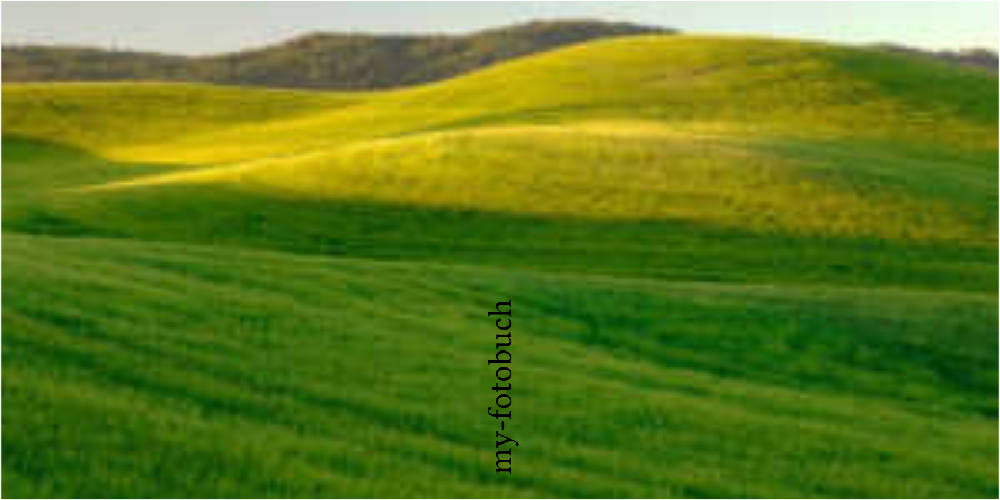
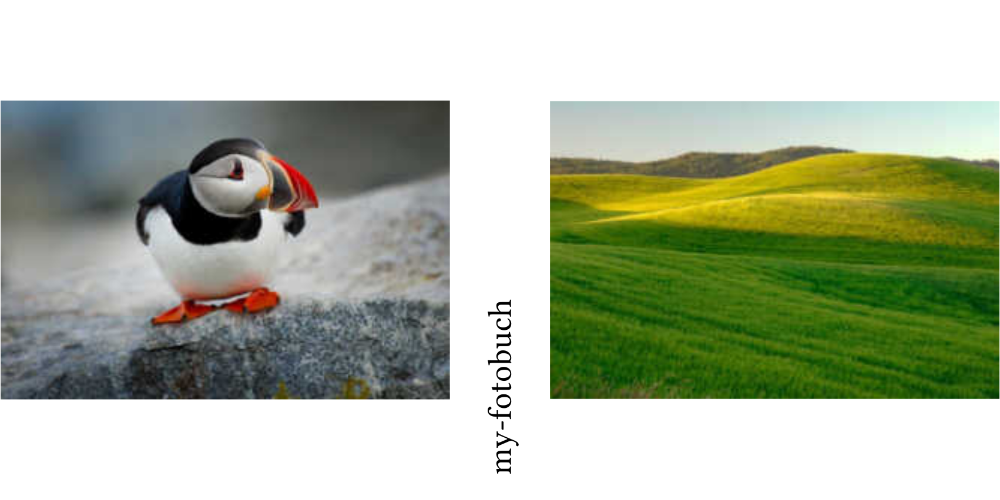
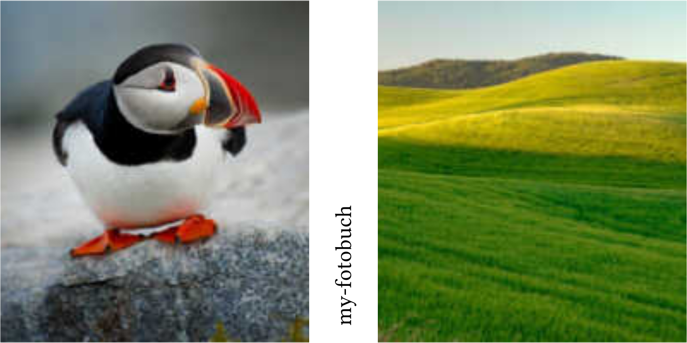
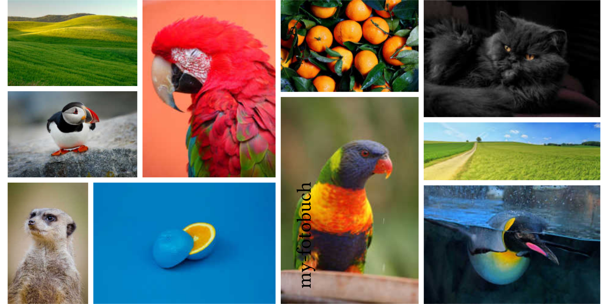

# Cover Modes

Each cover mode determines how photos are positioned and sized on the cover. The examples below show the result of each mode with a sample photo.

---

## Mode: `front`

A single photo on the front panel, with its aspect ratio preserved and centred.

---

## Mode: `front-full`

A single photo fills the entire front panel (may crop to fit).

---

## Mode: `back`

A single photo on the back panel, with its aspect ratio preserved and centred.

---

## Mode: `back-full`

A single photo fills the entire back panel (may crop to fit).

---

## Mode: `spread`

A single photo spans the full spread (front, spine, and back), with its aspect ratio preserved and centred.

---

## Mode: `spread-full`

A single photo fills the full spread without cropping space for the spine (may crop the photo).

---

## Mode: `split`

Two photos: slot 0 goes on the front panel, slot 1 on the back panel. Both have their aspect ratios preserved and are centred.

---

## Mode: `split-full`

Two photos: slot 0 fills the front panel, slot 1 fills the back panel (each may crop independently).

---

## Mode: `free`

The genetic algorithm solver optimises photo placement freely without constraints. Use any number of photos.

