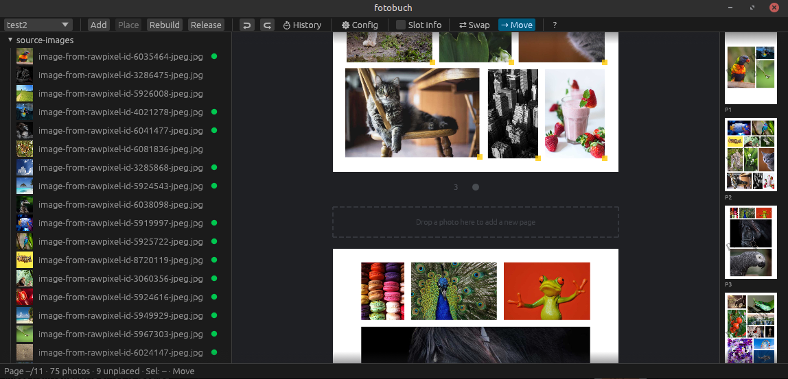

# GUI Overview

fotobuch is a photo book layout tool. You bring in your photos, the program arranges them across pages automatically, and you export a print-ready PDF — all without any manual design work. The GUI is the main way to work with fotobuch interactively.

## Window layout

The window has five areas:

| Area              | Position | Purpose                                         |
| ----------------- | -------- | ----------------------------------------------- |
| **Toolbar**       | Top      | Quick access to all main actions                |
| **Photo Pool**    | Left     | Your imported photos                            |
| **Central Panel** | Centre   | The page canvas — what your book will look like |
| **Nav Bar**       | Right    | Miniature page overview for jumping around      |
| **Status bar**    | Bottom   | Current state and progress messages             |

## How to create a photo book

See [quickstart](quickstart.md).

## Multiple projects

You can keep several photo books — for example one per year or one per event. Use the project dropdown at the top-left of the toolbar to switch between projects or create new ones. All projects in the same folder are kept together, so opening that folder next time shows all of them.

## CLI and GUI interoperability

The GUI and the `fotobuch` command-line tool operate on exactly the same project data. You can open a project in the GUI that was created and populated entirely from the CLI, or use the CLI and GUI on the same project in sequence — for example, run CLI commands for scripting or batch operations, then open the GUI for visual review and fine-tuning. The only rule is not to run both tools on the same project at the exact same time; alternating between them is completely fine.

The shared format is a YAML file and a Typst template tracked by git inside the vault, so every tool that understands git can inspect the full change history.
